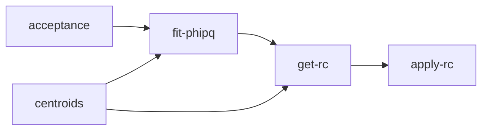

# clas-hadron-corrections
Software that corrects hadron data in a five-dimensional phase space using ROOT. Currently, the software is hard-coded to work with the following variables: Q2, Nu, Zh, Pt2, and PhiPQ.
If you need to use this software to fully correct hadron data follow the order shown in the diagram below. However; if you only need acceptance-corrected data it is not necessary to execute the rest of the software beyond *acceptance*.
## Dependence between the processes


## Setting the environment
1. Add the slib path of HAPRAD to the env. variable LD_LIBRARY_PATH located in your *.bashrc* script, like this:
```
export LD_LIBRARY_PATH=$LD_LIBRARY_PATH:"other_paths_already_set":"path_to_clas-hadron-corrections/haprad-cpp/slib"
```
2. Source the .bashrc file 

## Setting the specs for the analysis
### analysis-constants.h
1. Set the binning you want to use in the analysis. Q2, Nu, and Zh can have bins of different sizes because it is usual practice. At the moment, there are no plans to include this feature in Pt2 and PhiPQ.
2. Specify additional cuts you would like to use on the TCut arrays. Cuts by default are applied on Q2, Nu, Zh, and the vertex; the rest of the cuts are considered additional.
    1. Remember to adjust the array size to the number of cuts inside of it.
    2. The cuts by default are used to speed up the operations of the software by using TEventLists.

### names.h
1. Set the directories of data and simulations as absolute paths.
2. Set the extensions of the data and simulation files.
    1. What is the extension? We use files where the name of the target comes first, the rest is the extension. For instance: *C_data_Npion.root*. The extension is *_data_Npion.root*

## How to use?
In the folder *src-jobs* you can find the scripts that sends the jobs. To send the jobs use:
```
bash send-jobs-X.sh
```
Follow these notes to successfully execute this software:
- Make sure the number of bins in Q2, Nu, and Zh, are the same as those specified in *analysis-constants.h*.
- Make sure to follow the order/dependence described in the diagram above. For instance, you need all the resulting files from *centroids* to use *get-rc*.
- Set target and vertex cut according to the options spicified in the scripts.
    - Note: The target options are shown considering that the data files have both solid-liquid targets results and the simulation files have a separate file for the liquid target results.