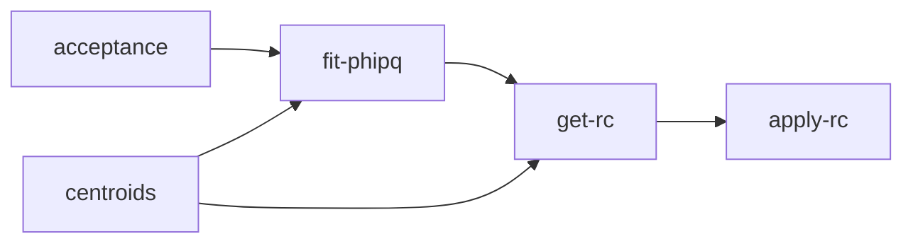

# clas-hadron-corrections
Software that corrects hadron data in a five-dimensional phase space. Currently, the software is hard-coded to work with the following variables: Q2, Nu, Zh, Pt2, and PhiPQ.

## Prerequisites
- ROOT

## Setting the environment
1. Add the slib path of HAPRAD to the env. variable LD_LIBRARY_PATH located in your *.bashrc* script, like this:
```
export LD_LIBRARY_PATH=$LD_LIBRARY_PATH:"other_paths_already_set":"path_to_clas-hadron-corrections/haprad-cpp/slib"
```
2. Source the .bashrc file 

## Setting the specs for the analysis
### analysis-constants.h
1. Set the binning you want to use in the analysis. Q2, Nu, and Zh can have bins of different sizes because it is usual practice. At the moment, there are no plans to include this feature in Pt2 and PhiPQ.
2. 

## Dependence between the processes
